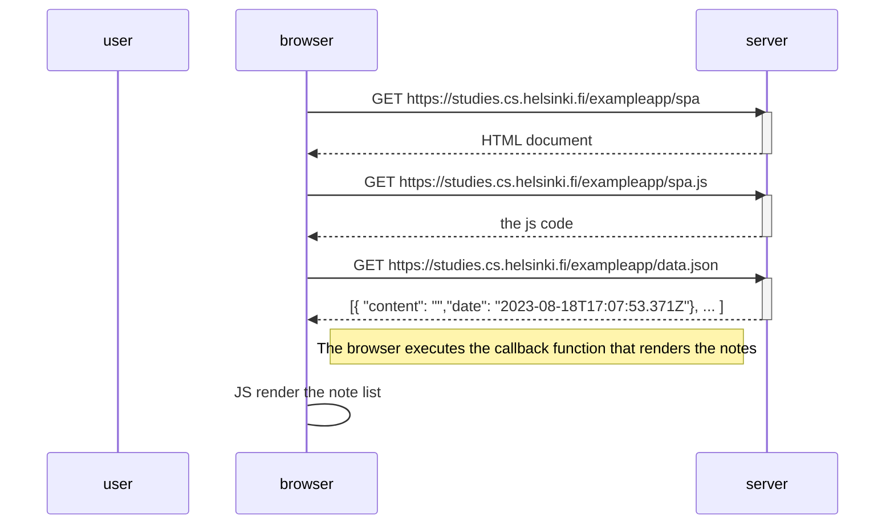

```mermaid
sequenceDiagram
participant user
participant browser
participant server


    browser->>server: GET https://studies.cs.helsinki.fi/exampleapp/spa
    activate server
    server-->>browser: HTML document
    deactivate server


    browser->>server: GET https://studies.cs.helsinki.fi/exampleapp/spa.js
    activate server
    server-->>browser: the js code
    deactivate server


    browser->>server: GET https://studies.cs.helsinki.fi/exampleapp/data.json
    activate server
    server-->>browser: [{ "content": "","date": "2023-08-18T17:07:53.371Z"}, ... ]
    deactivate server

    Note right of browser: The browser executes the callback function that renders the notes
    browser -> browser: JS render the note list

```
